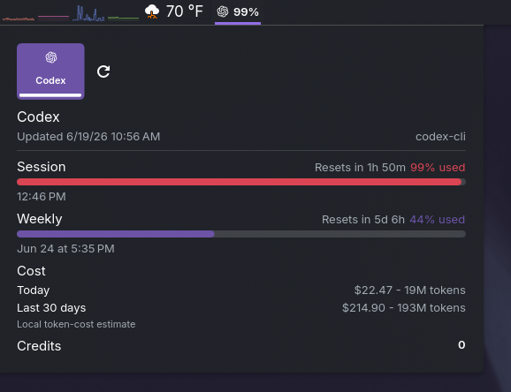

# KodexBar

[Read in English](README.md)

> Cuotas ordenadas de proveedores de IA en tu panel de KDE Plasma.

[](https://kde.org/plasma-desktop/)
[](https://github.com/steipete/CodexBar)
[](LICENSE)

KodexBar es un widget para KDE Plasma 6 que permite consultar las cuotas de proveedores de IA mediante la [CLI CodexBar](https://github.com/steipete/CodexBar). Ofrece un resumen compacto configurable en el panel y un popup completo con todos los proveedores y cuotas habilitados.



## Funciones

- Usa el diseño oscuro seleccionado de 520 por 560 con pestañas de proveedores, estado real, etiquetas de fuente, distintivos de ventana, barras de progreso y una vista previa compacta coincidente.
- Muestra una cuenta de proveedor a la vez, ordenada como Codex, Claude, Grok, Antigravity y después todos los demás proveedores habilitados.
- Mantiene separadas las cuentas repetidas con ordinales estables no sensibles en pestañas y salida compacta.
- Usa los SVG suministrados de Codex, Claude, Grok, Antigravity y Gemini, y mantiene distintas las identidades de Antigravity y Gemini.
- Agrega `compactProviderOrder`, una selección ordenada de proveedores para el panel compacto.
- Agrega `compactQuotaSelection`, una selección de cuotas para el panel compacto.
- Usa `codex,claude,grok,antigravity` como valor predeterminado.
- Compara los identificadores sin distinguir mayúsculas y elimina duplicados.
- Mantiene visibles como `ERR` los proveedores incluidos que devuelven errores.
- Omite proveedores no seleccionados únicamente en el panel compacto.
- Conserva todos los proveedores y cuotas detectadas en el popup.
- Siempre adquiere los proveedores habilitados en CodexBar. Los ajustes compactos nunca limitan la adquisición.
- Conserva varias cuentas devueltas con el mismo identificador de proveedor.
- Agrega ordinales estables como `Cx #1` y `Cx #2` sin exponer correos de cuentas.
- Muestra etiquetas compactas y porcentajes usados de las ventanas primaria y semanal en una línea.
- Muestra las ventanas adicionales seleccionadas con cualquier porcentaje de uso, sin umbral automático.
- Muestra ventanas estándar primarias, secundarias y terciarias en el popup cuando se conoce su uso o reinicio.
- Usa prefijos mínimos únicos y deterministas para cuotas adicionales, conservando `Fb` para Fable.
- Mantiene desplazamiento horizontal en las pestañas cuando el popup contiene muchos proveedores o cuentas.
- Muestra una sola vez cada resumen de costos por proveedor cuando varias cuentas comparten proveedor.
- Etiqueta la pestaña de Antigravity como `Antigravity` y presenta su encabezado completo como `Gemini (Antigravity)`.
- Colorea los puntos de estado compactos según el peor uso seleccionado, con advertencia al 50 por ciento, error al 80 por ciento y estado neutro cuando no hay uso disponible.
- Corrige el orden invertido de ventanas de Gemini cuando la CLI reporta una ventana primaria más larga que la secundaria.
- Conserva detalles específicos, reinicios, créditos, estado y resúmenes de costos del popup upstream.

## Requisitos

- KDE Plasma 6
- `kpackagetool6`
- La CLI upstream `codexbar` disponible en `PATH`, o una ruta completa configurada en los ajustes del widget

Instala la CLI con Homebrew en Linux:

```sh
brew install steipete/tap/codexbar
codexbar --version
codexbar usage --format json --pretty
```

También puedes descargar un archivo de la CLI para Linux desde los [releases de CodexBar](https://github.com/steipete/CodexBar/releases/latest).

CodexBar administra las credenciales y los proveedores habilitados. Configura las CLI, sesiones OAuth o claves API que requieran tus proveedores.

## Advertencia de compatibilidad

Este fork usa intencionalmente el mismo identificador de plugin de Plasma que upstream, `org.kde.plasma.kodexbar`. Reemplaza una instalación upstream en el mismo lugar. No instales al mismo tiempo el widget upstream y este fork.

La configuración existente del widget de Plasma permanece asociada a ese identificador. Una migración única convierte la selección heredada y oculta de proveedor en la selección compacta. Un proveedor específico se convierte en ese identificador, `all` se convierte en un filtro compacto vacío y `detect` conserva el orden predeterminado. Un orden compacto ya personalizado nunca se sobrescribe.

## Instalación

Clona el fork e instálalo:

```sh
git clone https://github.com/Karasowl/KodexBar.git
cd KodexBar
kpackagetool6 -t Plasma/Applet -i .
```

Si `kpackagetool6` informa que el paquete ya existe, usa el comando de actualización porque este fork reemplaza el mismo identificador:

```sh
kpackagetool6 -t Plasma/Applet -u .
```

Después agrega **KodexBar** a un panel de Plasma si todavía no está presente.

## Actualización

Actualiza el clon y reemplaza el paquete instalado:

```sh
git pull --ff-only
kpackagetool6 -t Plasma/Applet -u .
```

Reinicia Plasma solamente si el shell no recarga automáticamente el paquete modificado:

```sh
plasmashell --replace
```

## Desinstalación

Elimina el identificador compartido del plugin:

```sh
kpackagetool6 -t Plasma/Applet -r org.kde.plasma.kodexbar
```

Esto elimina el paquete KodexBar que ocupe ese identificador, ya sea upstream o este fork.

## Uso

- Haz clic en el elemento del panel para abrir el popup.
- Usa el botón de actualización para consultar la CLI inmediatamente.
- Abre los ajustes del widget para elegir fuente, intervalo y campos del panel.
- El widget siempre solicita los proveedores habilitados en CodexBar.
- Usa las casillas visibles de proveedores para elegir cuáles aparecen en la bandeja del sistema. Edita `Compact providers` cuando necesites un orden personalizado o un identificador adicional.
- Edita `Compact quotas` para seleccionar los valores de cuota mostrados en la bandeja del sistema.
- Deja vacío `Compact providers` para mostrar todos los proveedores devueltos en el orden de la CLI.
- Deja vacío `Compact quotas` para mostrar las etiquetas de proveedores sin valores de cuota.
- Abre el popup para ver todos los proveedores y cuotas detectadas sin importar la selección compacta.

La salida compacta predeterminada sigue esta forma:

```text
[icono Codex] S24% W61% | [icono Claude] ERR | [icono Grok] S8% W31% | [icono Antigravity] S0% W1%
```

`S` es el porcentaje usado de la ventana Session, conservada internamente como la clave de cuota `primary`. `W` es el porcentaje usado de la ventana semanal o secundaria. Los valores anteriores son ilustrativos y no son datos reales de una cuenta.

Cuando CodexBar devuelve varias cuentas del mismo proveedor, el panel compacto agrega ordinales no sensibles como `Cx #1` y `Cx #2`. Los ordinales permanecen visibles cuando se desactivan las etiquetas de proveedor. Los correos de cuenta permanecen limitados al campo opcional del popup.

La selección de cuotas predeterminada es `primary,weekly`. Estas claves globales se aplican a cada proveedor seleccionado para el panel compacto. Agrega `extras` para incluir la ventana terciaria estándar y todas las entradas de `extraRateWindows`. Para elegir valores individuales, usa claves calificadas por proveedor como `codex.primary`, `antigravity.tertiary`, `claude.weekly` y `claude.fable-only`. Una clave `extras` calificada, como `claude.extras`, selecciona su ventana terciaria y todas sus ventanas adicionales detectadas. Los títulos de cuotas adicionales se convierten en claves estables en minúsculas con palabras separadas por guiones. Sus etiquetas visibles usan el prefijo único más corto, con un mínimo de dos caracteres dentro del proveedor. Los títulos idénticos reciben ordinales. Cada bloque visual de proveedor tiene un límite y elide su texto con seguridad, mientras los valores completos permanecen disponibles en el modelo compacto.

### Adquisición y selección compacta

Cada actualización ejecuta la consulta predeterminada de uso de CodexBar sin sobrescribir `--provider`. Así, CodexBar respeta sus controles de proveedores habilitados y el popup recibe cada proveedor habilitado y cuenta devuelta. Se evita intencionalmente `--provider all` porque CodexBar 0.40.0 también devuelve proveedores deshabilitados con esa opción explícita.

`Compact providers` y `Compact quotas` solo controlan el resumen de la bandeja del sistema después de recibir la respuesta de la CLI. Nunca eliminan datos del popup. Una selección inválida de proveedor o cuota muestra `No selection` con un icono neutral, en vez de sugerir que Codex está seleccionado.

### Etiquetas de Gemini

El popup usa `Gemini (Antigravity)` para Antigravity y `Gemini` para el proveedor independiente de Gemini. Las etiquetas compactas también son distintas. Antigravity usa `Ag` y Gemini usa `Gm`, por lo que sus valores de cuota no se combinan visualmente.

## Ajustes

| Ajuste | Propósito |
| --- | --- |
| Command | Nombre del binario `codexbar` o su ruta completa. |
| Source | `Best available`, `auto`, `web`, `cli`, `oauth` o `api`. |
| Refresh | Intervalo de consulta entre 10 y 3600 segundos. |
| Compact providers | Identificadores ordenados y separados por comas que usa la bandeja del sistema. Las casillas visibles cubren Codex, Claude, Grok y Antigravity. Vacío muestra todos los proveedores devueltos y nunca filtra el popup. |
| Compact quotas | Claves de cuota separadas por comas. Admite claves globales y calificadas por proveedor. Vacío muestra solo etiquetas y nunca filtra el popup. |
| Show provider in panel | Incluye el icono de cada proveedor seleccionado en el resumen compacto. |
| Show used percent in panel | Incluye porcentajes de uso en la salida compacta. |
| Show credits in panel | Incluye créditos disponibles como valores `Cr` en cada bloque compacto. Está desactivado de forma predeterminada. |
| Show email in widget | Muestra el correo de la cuenta en el popup cuando está disponible. |
| Fetch provider status | Solicita y muestra información del estado del proveedor. |
| Show local cost summary | Muestra estimaciones locales de tokens y costos cuando están disponibles. |

## Datos y privacidad

El widget ejecuta localmente `codexbar usage --format json --json-only` y presenta el JSON devuelto. Los resúmenes opcionales de costos vienen de `codexbar cost`. Este repositorio no agrega un backend de proveedor, almacén de credenciales, servicio de telemetría ni servicio remoto de cuentas.

CodexBar administra autenticación, configuración de proveedores, llamadas API y consultas de CLI. Revisa el [proyecto CodexBar](https://github.com/steipete/CodexBar) para conocer sus proveedores compatibles y el manejo de datos.

## Validación

Ejecuta las pruebas deterministas y las comprobaciones estáticas:

```sh
scripts/validate.sh
```

La validación revisa JSON, XML, lógica con fixtures, QML, hashes de archivos conservados, patrones comunes de secretos, puntuación de documentos y errores de espacios.

Para inspeccionar los datos de la CLI antes de depurar el widget:

```sh
codexbar usage --format json --json-only --source auto | python3 -m json.tool
```

## Solución de problemas

| Síntoma | Solución probable |
| --- | --- |
| El widget muestra `No data` | Ejecuta el comando anterior y confirma que devuelve JSON útil. |
| Un proveedor incluido muestra `ERR` | Configura ese proveedor en CodexBar o inspecciona su error de CLI. |
| Falta un proveedor en la bandeja del sistema | Agrega su identificador exacto a `Compact providers`, o deja vacío el ajuste. |
| Falta una cuota en la bandeja del sistema | Agrega su clave global o calificada por proveedor a `Compact quotas`. El popup muestra el título detectado necesario para derivar una clave adicional. |
| La bandeja del sistema muestra `No selection` | Corrige una clave de proveedor o cuota en los ajustes compactos. El popup permanece completo. |
| El proveedor funciona en una terminal pero no en Plasma | Configura la ruta completa a `codexbar` porque Plasma puede no heredar el `PATH` del shell. |
| No aparece el estado | Activa **Fetch provider status**. |
| No aparece el resumen de costos | Ejecuta `codexbar cost --format json --pretty` y confirma que existen datos locales. |

## Atribución y licencia

Mantenido por [Karasowl](https://github.com/Karasowl). Basado en el proyecto KodexBar original de [tylxr](https://github.com/tylxr59).

Los datos de uso son suministrados por la [CLI CodexBar](https://github.com/steipete/CodexBar), un proyecto independiente. Consulta [NOTICE.md](NOTICE.md) para ver los detalles de atribución.

Distribuido bajo la licencia MIT original. Consulta [LICENSE](LICENSE). El archivo de atribución complementa la licencia y no la reemplaza.
