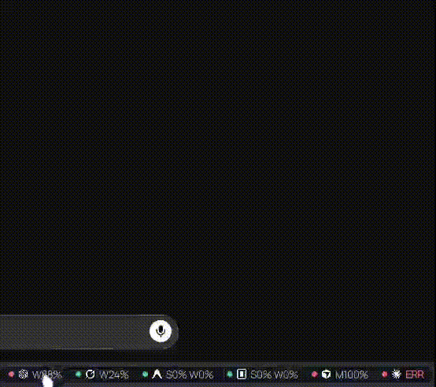

# KodexBar Suite

[Leer en español](README.es.md)

> Linux AI quota monitor and KDE Plasma 6 widget for coding assistants.

[](https://github.com/Karasowl/KodexBar-Suite/releases/latest)
[](https://kde.org/plasma-desktop/)
[](LICENSE)

KodexBar Suite puts AI coding quota and usage tracking in one Linux panel. The widget shows live usage, reset times, spend, and errors. Compact panel lets you hide a provider that is in ERR.



[Full 26s clip](docs/kodexbar-demo.mp4)

The KDE Plasma 6 widget shows provider usage windows, reset times, credits, costs, accounts, and errors without requiring a separate dashboard for every assistant. It is designed for Arch Linux, CachyOS, and other Linux systems running Plasma 6.

The complete suite is distributed through the [AUR](https://aur.archlinux.org/packages/kodexbar-suite), [GitHub Releases](https://github.com/Karasowl/KodexBar-Suite/releases), and a user-local installer from this repository. If this saves you from opening several provider dashboards, star the project so other Linux users can find it.

The repository contains two installable packages and their shared tooling:

- `packages/kodexbar` is a KDE Plasma 6 widget for ordered CodexBar quota and usage summaries.
- `packages/ai-cli-control` is the local `ai` selector for launching and updating provider CLIs, including read-only conversation recovery with `ai recover`.
- `local-ai`, installed with `ai-cli-control`, is an optional JSON monitor for local model runtimes. It does not install runtimes or download weights.
- `kodexbar-skills`, installed with `ai-cli-control`, inventories and synchronizes skills across six providers with confirmation, preflight, and identical-copy backups.

Each package remains usable and testable on its own, while the root installer provides the complete experience.

## What it monitors

The suite has dedicated quota paths for the providers below:

| Provider | Coverage |
| --- | --- |
| Claude Code | Native quota reading with multi-account profiles |
| OpenAI Codex | Native quota reading, credits, and multi-account profiles |
| Cursor | Native monthly billing usage with Models, Other, Total, Auto, and API views |
| Grok | Native usage and billing data from the local account session |
| OpenCode Go | Native quota detection and provider identity |
| Antigravity | Optional companion path through the upstream CodexBar CLI |

The widget can also display other providers returned by CodexBar when they are enabled. The suite does not invent quota values when a provider does not return real data.

Beyond quota monitoring, the suite includes:

- **Multi-account profiles** for Codex and Claude without storing provider secrets in the suite.
- **Local model monitoring** through `local-ai`, with runtime-aware metrics and safe controls.
- **Cross-provider skill inventory and synchronization** for Codex, Claude, Grok, Gemini CLI, OpenCode, and Hermes.
- **AI CLI Control** for launching and updating provider CLIs from the current directory.

## Install the suite

**New to this? Follow the [step-by-step install guide](INSTALL.md).**

On CachyOS, Arch Linux, or another Linux system:

```bash
git clone https://github.com/Karasowl/KodexBar-Suite.git
cd KodexBar-Suite
./install.sh
```

The installer:

- installs or updates the Plasma applet when `kpackagetool6` is present.
- still installs the data engine, tray, and panel tools when Plasma is absent, so GNOME, COSMIC, Hyprland/Waybar, and XFCE can use the suite.
- installs `ai` at `~/.local/share/ai-cli-control/ai`.
- creates `~/.local/bin/ai` only when that link is absent or already belongs to this project.
- never uses `sudo` and never replaces an unrelated `~/.local/bin/ai`.
- warns if `~/.local/bin` is not on `PATH`.

The shared Plasma ID is intentional. This package replaces an existing upstream KodexBar installation in place, while preserving the Plasma configuration associated with that ID.

After installation, add **KodexBar Suite** to a Plasma panel if it is not already present. Open the widget popup to view quotas. Use the AI button or the Plasma context menu to open `ai-cli-control` and update provider CLIs.

The Signal Console popup uses labeled Providers, Local, and Skills destinations. Local reads its inventory through `local-ai`, which supports explicit model roots and common localhost runtimes. It displays only real runtime metrics, preserves unmounted installed models in a dimmed state, and exposes only actions a runtime can perform safely. See [the local model monitor documentation](packages/ai-cli-control/README.md#local-model-monitor) and its portable templates under `packages/ai-cli-control/examples/`.

The **Skills** tab uses `kodexbar-skills` to compare Codex, Claude, Grok, Gemini CLI, OpenCode, and Hermes. A matrix stages changes per skill and provider, selects every safe target or one complete provider column, and previews the batch before applying it. Refresh is read-only. Identical copies are backed up, shared links can be disabled without deleting their source, and divergent content stays locked. See [the skill engine contract](packages/ai-cli-control/README.md#skill-inventory-and-synchronization).

## Installation channels

The complete KodexBar Suite is published through AUR and GitHub Releases.

### AUR (Arch and CachyOS)

Install the suite from the AUR:

```bash
paru -S kodexbar-suite
```

The same package also appears in graphical AUR helpers on CachyOS such as Shelly or Octopi. Packaging sources live in `packaging/aur/`.

After an install or upgrade, the package detects active sessions that actually have KodexBar on a panel and reloads `plasmashell` automatically. Panels may disappear for a few seconds. Sessions that do not use the widget are not restarted.

What the package installs under `/usr`:

- Plasma widget, `ai`, `kodexbar-quotas`, `kodexbar-panel`, `kodexbar-tray`, `local-ai`, `kodexbar-skills`, the built-in local model drivers, and tray icons.
- A zero-config first run: on first use without `~/.config/codexbar/config.json`, the suite detects which AI CLIs you already have and enables their quotas automatically. You do not need to edit config files or read provider docs.

How quotas work after install:

- **Claude, Codex, and Grok** quotas are fetched natively by `kodexbar-quotas` (Python stdlib). Claude needs Claude Code OAuth credentials. Codex reads `~/.codex/auth.json`. Grok reads `~/.grok/auth.json`. Expired or missing credentials show a re-login message (no automatic OAuth refresh).
- **Antigravity** still needs the companion CLI [`codexbar` by steipete](https://github.com/steipete/CodexBar). The same CLI is an optional fallback for Codex and Grok when the native path hits a retryable network or infrastructure failure. On Arch/CachyOS install it as `codexbar-cli-bin` (not the unrelated AUR package also named `codexbar`).
- An existing CodexBar config is never overwritten. The widget does **not** invent placeholder quota numbers.

### GitHub Releases

GitHub Releases provides the matching source archive and release artifacts.

### KDE Store (widget-only channel)

KDE Store is a separate distribution channel for the Plasma widget only. The published `.plasmoid` is built by `packaging/kde-store/build-plasmoid.sh`, and its version comes from `packages/kodexbar/metadata.json`. That channel delivers the applet UI only. The data engine (`kodexbar-quotas` and related tools) still comes from the AUR package or from the repository `install.sh` below. If the widget is installed without the engine, the popup shows a setup card with the Arch AUR command on Arch family systems, or the portable `./install.sh` command on other distros, plus a link to the repository. After the suite is installed, the next refresh detects your CLIs and shows their quotas without manual provider configuration.

### Manual install from this repository

Clone and run the root installer for a user-local layout under `~/.local` (no `sudo`):

```bash
git clone https://github.com/Karasowl/KodexBar-Suite.git
cd KodexBar-Suite
./install.sh
```

For Antigravity quotas (and optional Codex/Grok fallback) on a non-Arch install, also install the official CodexBar CLI and keep `codexbar` on your `PATH`. See [CodexBar CLI docs](https://github.com/steipete/CodexBar/blob/main/docs/cli.md).

### Migrating from a manual `~/.local` install to the package

A previous manual install under `~/.local` takes priority over the system package: a typical `PATH` puts `~/.local/bin` before `/usr/bin`, and Plasma prefers user-local applet data over `/usr/share/plasma/plasmoids`. To use only the packaged files:

1. From a clone of this repository (the same tree you used to install), run `./uninstall.sh`. That script only touches `~/.local` and follows its ownership checks. It does not remove the pacman package.
2. Restart plasmashell so Plasma reloads the system plasmoid, for example: `systemctl --user restart plasma-plasmashell.service` (or log out and back in).

After that, `which ai` and `which kodexbar-quotas` should resolve under `/usr/bin` when the package is installed.

## Update

```bash
git pull --ff-only
./install.sh
```

The root installer is idempotent. It updates both packages without touching provider credentials or configuration and reloads the current Plasma session when KodexBar is present on a panel.

## Uninstall

```bash
./uninstall.sh
```

The root uninstaller removes the Plasma package only when the installed package identifies itself as KodexBar Suite and removes `ai` only when its ownership marker and symlink match this project. If either ownership check fails, it refuses that removal instead of touching another installation.

## Use a package independently

The package directories retain their standalone workflows:

```bash
make -C packages/ai-cli-control check
./packages/ai-cli-control/install.sh

bash packages/kodexbar/scripts/validate.sh
kpackagetool6 -t Plasma/Applet -u packages/kodexbar
```

Do not install the upstream widget and this fork at the same time because both use `org.kde.plasma.kodexbar`.

## Development checks

```bash
make test
make check
```

`make check` runs the KodexBar fixture, JSON, XML, QML, and safety checks, the `ai-cli-control` Python and shell checks, and root script syntax and whitespace checks. It does not install or uninstall anything.

## Repository layout

```text
KodexBar-Suite/
├── packages/
│   ├── kodexbar/
│   └── ai-cli-control/
├── install.sh
├── uninstall.sh
├── Makefile
├── LICENSE
└── NOTICE.md
```

The subtree history preserves the original package histories. `packages/kodexbar` is a maintained fork of [tylxr59/KodexBar](https://github.com/tylxr59/KodexBar). `ai-cli-control` is independent original work. See the package notices and the root [NOTICE.md](NOTICE.md) for attribution.

## License

The package-specific license files remain authoritative:

- [KodexBar package license](packages/kodexbar/LICENSE)
- [ai-cli-control package license](packages/ai-cli-control/LICENSE)

Both packages use the MIT License. The root [LICENSE](LICENSE) explains the scope of the monorepo license files.
